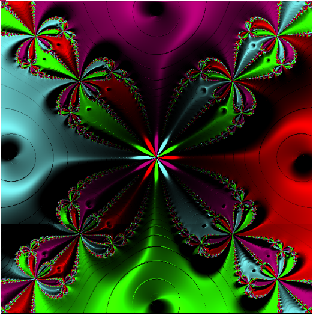

# Newton-fractal

## Introduction

Newton's method is used to calculate to which root of a polynomial converges each point of a plane. For Newton's fractals, each root is associated to a colour. For each point of the plane, we look towards which root it converges and we paint it with the associated colour. In this way, we obtain coloured images. In this topic, I tried to create these images. I get into all polynomials, but particularly in those of the form z(^n)-1. With my partner we created a flat version and a raised version of these fractals.

## Introductory functions
***calcul_racines***

We used this function to calcultate the z(^n)-1 polynomials' roots. We used the form "exp(2jk*pi/n)" to create this function

***racine_couleur***

This function has been created to associate the roots to a colour.  It uses a formula that allows us to obtain different colours depending on a step which depends on the number of the roots.

## Flat Version

***Newton1***

This function applies the Newton's Method. Newton's method uses a sequence to approach the complex roots of polynomials equation P(z)=0.

***Fract_Newt***

This first main function takes each point of the plane successively, applies Newton's method to it in order to associate it with a colour and paint it on the image.

## Raised Version

***newton2*** 
This function is an adaptation of Newton1. However, it calculates the sequence (dz)) in order to calculate Z, the depth of the point.

***Fract_Newt_Relief*** 

This second main function, uses for each point of the plane
newton2, to calculate the root, to which it converges and its depth.
The function create the vectors N (normal to the fractal) and S (directed from the light source of the plane, in order to paint the fractal in relief with its shadows and lights). This function is using memoization.

